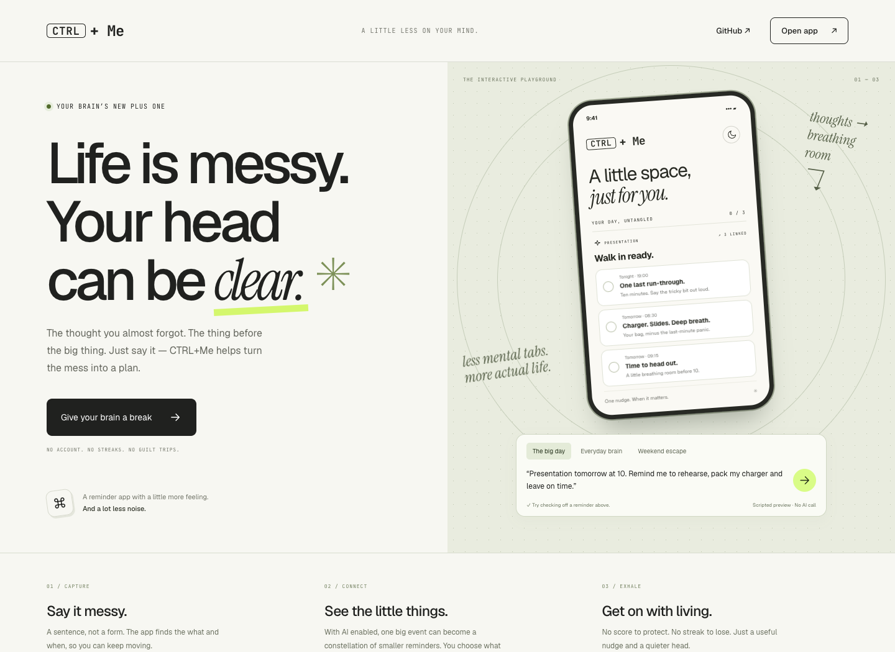
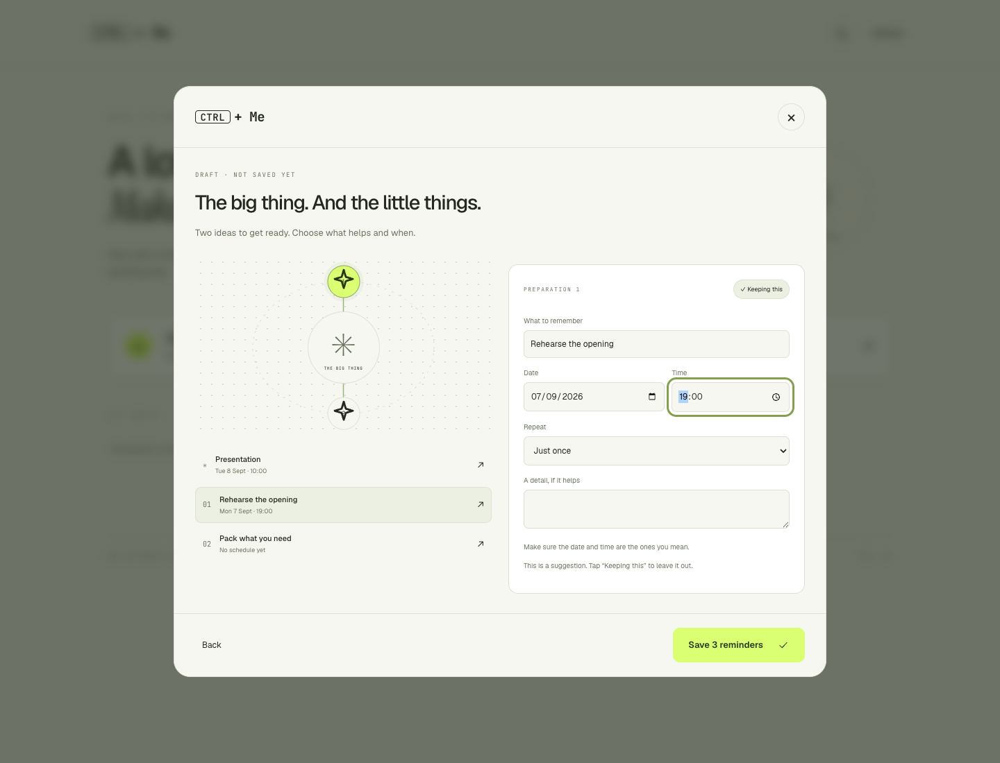
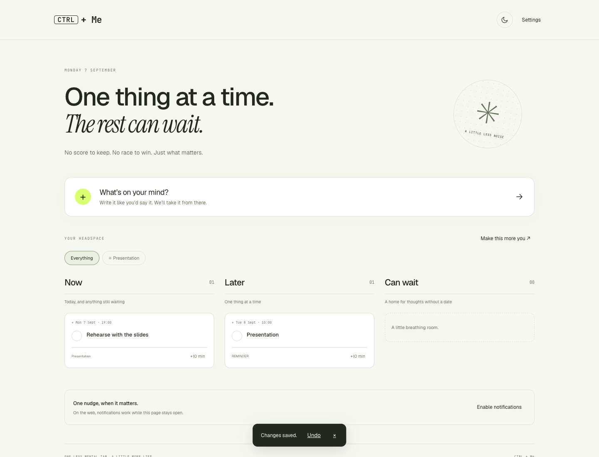

<div align="center">

# CTRL+Me

**Your brain’s new plus one.** A thoughtful reminder app that reads the room —
you type the messy sentence you'd actually say out loud, and it comes back as a
clean reminder, at the right time, in your tone.

[**Live demo**](https://elisasimoni.github.io/ctrl-me/) · [**Open app**](https://elisasimoni.github.io/ctrl-me/#app) · [Android APK](https://github.com/elisasimoni/ctrl-me/releases/latest)


<a href="https://elisasimoni.github.io/ctrl-me/"></a>

</div>

---

## The idea

Reminder apps make *you* do the structuring: pick a date, pick a time, pick a
list, write a title. CTRL+Me does the structuring itself. You type
*"remind me to take my pill every day at 8"* and it extracts the action,
parses the time, picks an icon, replies in your language and tone, and files
away the parts worth remembering.

The other half of the idea is restraint. No streaks, no confetti, no 7am
affirmations — one nudge, when it actually matters, and silence otherwise.

## From a thought to a little breathing room

Open the app and capture your first thought immediately. No account or mandatory
questionnaire. Try **“Presentation tomorrow at 10”**, then review the draft:

1. Select the main event or a connected preparation node.
2. Edit the title, date, time, repeat setting, or notes.
3. Keep or drop the optional preparations. Nothing is saved until you confirm.
4. Find your reminders under **Now**, **Later**, and **Can wait**. Complete,
   snooze by ten minutes, or edit one; Undo restores the previous reminder.





| Feature | What to expect |
|---|---|
| **Local capture** | English and Italian time expressions, today/tomorrow, weekdays, ISO dates, and explicit daily repeats. No API key required. |
| **Optional preparations** | Local templates offer untimed preparations for presentations, interviews, exams, trains, flights, and trips. They are suggestions, not AI inference. |
| **AI capture** | With your own key, Claude returns a structured draft and optional linked reminders. Follow-up questions appear in the review. |
| **Review before saving** | All nodes are editable. A timed one-off reminder requires a date. Untimed items remain on your list without scheduling a notification. |
| **A calmer home** | Today and overdue items in Now, future dates in Later, undated thoughts in Can wait. Filter by constellation. Completed items fold away. |
| **Notifications** | Explicit opt-in, date-aware scheduling, ten-minute snooze, daily repeats, and quiet hours. Web requires the page to stay open; Android uses native scheduling. |
| **Personalization** | Theme, language, tone, profile, and behavior summaries stay available in Settings and “Make this more you.” |
| **Weather** | Optional Open-Meteo weather suggestions when both weather and location preferences are enabled. |
| **Installable** | Offline-capable PWA and Capacitor Android app. Existing local reminders and preferences are retained. |

## Try the playground

[**Give your brain a break →**](https://elisasimoni.github.io/ctrl-me/)

Choose **The big day**, **Everyday brain**, or **Weekend escape**. Run the preview,
watch one thought become three linked reminders, check them off, and switch
between Pebble and OS. Works on desktop and mobile, with reduced-motion support.

The playground uses **scripted English scenarios**, not live AI inference. It
makes no API calls and saves no demo reminders to your personal list. Open the
[full app](https://elisasimoni.github.io/ctrl-me/#app) to capture your own thoughts;
the app works locally without a key, with optional Claude-powered analysis.

The public experience starts in English. Italian remains available in the app’s
Settings, and your language choice is remembered. Installed PWAs and Android
launch directly into the app.

## How the AI part works

The constraint that shaped everything: this call runs on *every* reminder a user
types, so it had to be one small model call, not a chain.

```
profile   ─┐
behavior  ─┼─→ user turn ─→ Haiku 4.5 ─→ JSON schema ─→ reminder (+ cluster,
memory    ─┤                 (cached system prompt)      followups, new facts)
user text ─┘
                └─→ on any failure ─→ local regex parser
```

- **One call, structured output.** The response is constrained by a JSON schema
  (`output_config.format`), so there's no prose to parse and no
  "sometimes it wraps the JSON in markdown" class of bug.
- **Prompt caching.** The system prompt is long — rules, a field spec, behavioural
  guidance, worked examples — and never changes, so it's marked
  `cache_control: ephemeral`. Per-call cost is then essentially the user's sentence.
- **Everything variable lives in the user turn.** Profile, behaviour summary and
  remembered facts are prepended to the *user* message precisely so the cached
  system prompt stays byte-identical and keeps hitting the cache.
- **Behaviour is summarised, not dumped.** `src/lib/behavior.js` reduces the raw
  event log to a handful of short clauses ("frequently dismissed: X", "most
  reliable window: morning") — small enough to stay cheap, concrete enough for
  the model to act on.
- **Graceful degradation is the default path, not an afterthought.** No key, a
  network failure, or a malformed response all land in the same local parser, and the draft explains when local analysis was used. Requests time out after 20 seconds and close with the capture dialog.

Worth reading: [`src/lib/llm.js`](src/lib/llm.js) (the prompt),
[`src/lib/behavior.js`](src/lib/behavior.js) (the signals),
[`src/lib/planning.js`](src/lib/planning.js) (calendar dates and local drafts).

## One calm workspace, two themes

Warm paper, editorial type, sage details, and lime actions carry the playground’s
identity into the real app. Switch to the dark theme from the header or Settings.
Desktop has three spacious columns; mobile flows into a single readable list.
Capture and review work with a keyboard and respect reduced-motion preferences.

## Stack

- **React 18 + Vite 5** — no UI framework, no CSS framework; the shared primitives live in [`src/atoms.jsx`](src/atoms.jsx).
- **vite-plugin-pwa / Workbox** — installable, offline-capable.
- **Capacitor 8** — Android wrapper. Notifications and geolocation go through
  native APIs when installed and browser APIs on the web;
  [`src/native/`](src/native/) hides the difference behind one interface.
- **Anthropic SDK** — `claude-haiku-4-5`.
- **Open-Meteo** — weather, no key required.
- **localStorage** — all state. No backend, no account, nothing leaves the device
  except data sent to enabled services: AI analysis includes your input, profile, behavior summary, and remembered context; weather uses your location.

## Run it locally

```bash
npm install
npm run dev      # http://localhost:5173
npm test         # date parsing, recurrence, notification cancellation
npm run build    # production build → dist/
npm run preview  # serve the built PWA (open it on your phone to install)
```

To enable the Haiku flow, either paste a key at runtime under **⚙ → AI brain**,
or set it at build time:

```bash
cp .env.example .env.local   # then set VITE_ANTHROPIC_API_KEY
```

The live demo uses the runtime option, since the deployed build ships no key of
its own.

### Android

```bash
npm run build
npx cap sync android
npx cap open android          # or: cd android && ./gradlew assembleDebug
```

Pushing a `v*.*.*` tag builds and publishes a debug APK via
[`.github/workflows/release.yml`](.github/workflows/release.yml).

## Where to look

- [`src/App.jsx`](src/App.jsx): capture, settings, notifications, and Undo.
- [`src/screens/CalmHome.jsx`](src/screens/CalmHome.jsx): first-use experience and three home sections.
- [`src/components/ThoughtCapture.jsx`](src/components/ThoughtCapture.jsx): draft review and editable constellation.
- [`src/lib/planning.js`](src/lib/planning.js): conservative local parsing and calendar dates.
- [`src/native/notifications.js`](src/native/notifications.js): native/web scheduling, cancellation, and recurrence.
- [`src/calm.css`](src/calm.css): shared light/dark product styling.
- [`tests/planning.test.js`](tests/planning.test.js): automated planning and scheduling checks.

Earlier visual explorations remain in `DirA`, `DirB`, `ThemeChooser`, and
`ConstellationReveal`; the main app now uses the calm workspace above.

## Known limitations

- **Local parsing is intentionally limited.** It does not understand arbitrary lists, natural-language calendar rules, or every date format. Review and edit the draft before saving.
- **AI dates need review too.** Date extraction is conservative; dates that cannot be identified stay empty rather than being invented.

- **The API key is client-side.** Whether it comes from `VITE_ANTHROPIC_API_KEY`
  at build time or from Settings at runtime, it lives in the browser — fine for a
  prototype, not fine for production. The real fix is a `/api/analyze` server
  route holding the key, at which point [`src/lib/apiKey.js`](src/lib/apiKey.js)
  and `dangerouslyAllowBrowser` both go away. Neither this repo nor any published
  build contains a key.
- **Web notifications only fire while the tab is open.** Scheduling survives
  backgrounding only in the Capacitor build, which uses real local notifications.
- **Recurrence is shallow.** "every day at 8" is handled as a daily repeat, but
  there's no general recurrence rule (every other Tuesday, last day of month…).
- **The behaviour log lives on one device.** No sync, so patterns don't follow you
  between phone and browser.

## License

MIT © Elisa Simoni — see [LICENSE](LICENSE).
